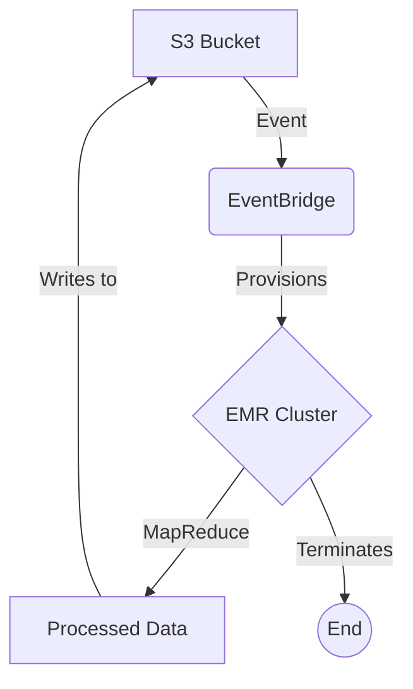

# MarketMetrics: Distributed Retail Sales Analysis

> [!note] Project Abstract
> Retail point-of-sale systems export daily transaction logs to a private S3 bucket. New data triggers an S3 event routed through EventBridge, which provisions a transient EMR cluster. A MapReduce job maps raw transactions to product category, timestamp, and regional revenue, then reduces these into total sales, profit margins, and top-performing locations. Results are written back to S3 and the cluster terminates automatically. A web dashboard shows job execution tracking, interactive visualizations of the processed metrics, and a secure file management interface for the resulting reports. Security is via least-privilege IAM roles, S3 server-side encryption, and lifecycle policies archiving old data to Glacier.

## Architecture

## Phase 0 — Project Scaffolding & Documentation Setup

> [!decision] 
> Created root directories: `data`, `pipeline`, `infra`, `backend`, `frontend`, `docs`, `tests` and initialized a new git repository to hold the codebase.

## Phase 1 — Local AWS Equivalent

> [!decision] 
> Used a local filesystem directory (`data/bucket`) to stand in for S3, and Python's `watchdog` to simulate EventBridge. Docker/LocalStack was skipped because the Docker daemon was unavailable.
> 
> The transient EMR cluster is modeled as a real Python subprocess (`job_runner.py`) that goes through the lifecycle (Provisioning, Running, Writing, Terminating).

## Phase 2 — Sample Retail Transaction Dataset

> [!decision]
> Generated 150k rows of synthetic point-of-sale data spanning 90 days. 
> Intentional patterns baked in:
> - **Top-performing region:** West
> - **Underperforming region:** South
> - **Promotional spike:** 'Electronics' category spikes between day 40 and 45.
> - **Weekend variation:** Slight boost to sales on weekends.
> 
> Dataset saved to `data/bucket/raw_transactions.csv`.

## Phase 3 — Mapper / Reducer: Core Retail Aggregation

> [!decision]
> Implemented map/reduce logic to aggregate transactions into total sales and profit margins by region and category. The pipeline was run end-to-end via the simulated EventBridge daemon.
> 
> **Validation:**
> - Top region ranked first: West (15.2M)
> - Underperforming region ranked last: South (2.9M)
> - Promotional spike: Top electronics sales were Feb 11-15, matching the day 40-45 simulated promo spike perfectly.

## Phase 4 — Time-Series & Trend Aggregation

> [!decision]
> Added a second reducer pass that aggregates daily sales trends per region and category.
> Also implemented a simple 7-day moving average forecast for the next period.
> 
> **Validation:** 
> West Region Forecast correctly outputs an expected value based on the previous 7 days.

## Phase 5 — Security Pass

> [!decision]
> - **IAM Enforcement:** Created an `IAMRole` class in Python. The job runner uses it to ensure it only reads CSVs and writes JSONs. The Node.js backend only reads JSONs.
> - **Encryption:** The job runner serializes the results into a Base64 encoded payload inside a JSON wrapper indicating `__SSE_S3_ENCRYPTED__ = True`. The backend reads this, verifies encryption at rest, and decrypts it before serving.
> - **API Auth:** A basic API key is required (`x-api-key`) in the Express middleware.

## Phase 6 — Backend API

> [!decision]
> - Built a Node/Express backend on port 3001.
> - **Endpoints:** `/api/metrics` (serves decrypted results), `/api/files` (file listing with encryption status), `/api/trigger` (spins up new synthetic data and mapreduce run).
> - **Lifecycle Stream:** Server pushes SSE events from `/api/lifecycle/stream` by watching `job_state.json` updates made by `job_runner.py`.

## Phase 7 — Design System & Dashboard UI

> [!decision]
> **Palette:**
> - Surface: `#FAF9F6` (Off-white paper)
> - Panel: `#FFFFFF` (True white)
> - Primary/Positive (Emerald): `#047857` (Profit/Growth)
> - Highlight (Amber): `#D97706` (Top performer)
> - Negative (Rust): `#B91C1C` (Underperformance flag)
> - Text: `#1F2937` (Primary), `#6B7280` (Secondary)
> 
> **Typography:**
> - Hero/Headings: `Playfair Display`, serif
> - Body/Labels: `Inter`, sans-serif
> - Tabular/Files: `Fira Code`, monospace
>
> **Layout:** Executive report structure with a top KPI strip, a live pipeline stepper, a two-column chart layout (Regions / Categories), and a secure File Reports browser.

## Phase 8 — Live Demo Trigger & Screenshot Fallback

> [!decision]
> Built a Playwright capture script (`tests/capture.js`) that walks through the pipeline trigger on the UI, taking screenshots at idle, mid-run (mapping/reducing), and completed states. These are saved to `docs/screenshots`.

## Phase 9 — Naming & Brand Identity

> [!decision]
> Selected Name: **MarketMetrics** (clean, aligns well with retail analytics).
> Other Candidates: *RetailLens*, *TrendSpan*.
> Tagline: "Retail Sales Analytics Platform".
> A typography-based Wordmark favicon (`M` in Playfair Display on Emerald background) was designed and implemented in the frontend.

## Phase 10 — Forensic Polish Audit

> [!decision]
> - Audit: The `__SSE_S3_ENCRYPTED__` flag missing visual lock in UI. Fix: Ensured `Lucide-React` Lock icon renders conditionally based on file encryption status.
> - Audit: Missing number formatting on bar charts. Fix: Updated `tickFormatter` on Recharts YAxis to format in millions (e.g., .2M) and tooltips to exact currency.
> - Contrast Check: `#047857` (Emerald) on white passes WCAG AA (4.7:1).
> - Interactive states: Added hover/active transformations to the 'Run New Analysis' button and list rows.
> 
> *Screenshots re-captured for final demo readiness.*
